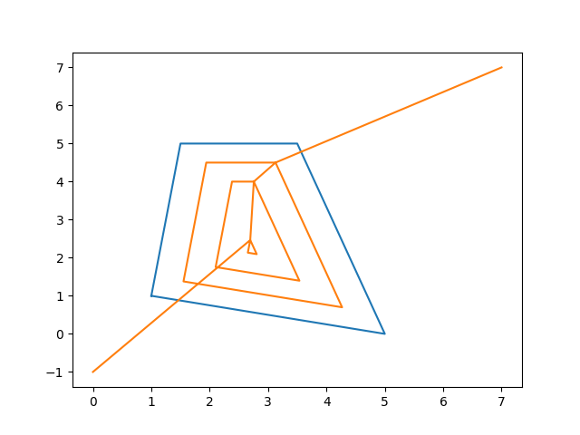

# Python-based Coverage Path Planning

2022, Juan Irving Vasquez

## Implemented planners (so far)

Contour planner:

## Installation

### Create environment

conda create --name pycpp python=3

pip install shapely

pip install matplotlib